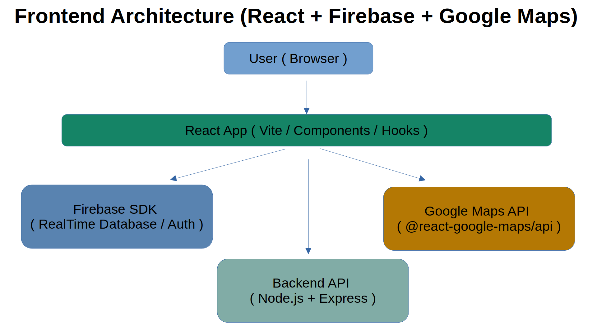

# Frontend README (React + Vite + Firebase)


## Overview
This frontend is a **React + Vite** application that manages users in real time. It interacts with:
- **Firebase Realtime Database** (for direct, real-time reads)
- **Node/Express backend** (for writes, updates, deletes, validation, enrichment)
- **Google Maps API** (for displaying users on a map with InfoWindows)
- **OpenWeatherMap API** (indirectly, through the backend enrichment)

The application implements:
- Real-time list of users (name, ZIP, latitude, longitude, timezone, local time).
- Inline create, edit (with ZIP re-enrichment), and delete actions.
- Search, filter by timezone, and row ↔ map interaction.
- A footer with author information and technologies used.

---

## Why Direct Firebase Reads from Frontend?

This decision was intentional:

- **Requirement alignment**: The task explicitly rewards using Firebase Realtime Database. Reading directly from Firebase takes advantage of its strengths: live subscriptions, offline support, and streaming updates without polling.
- **Performance**: By connecting the frontend directly to RTDB, users see updates instantly (sub-100ms) instead of going through the backend and re-broadcasting changes via sockets or polling.
- **Security**: The backend retains authority over writes (.write: false in RTDB rules). Clients cannot write directly, which prevents tampering. Reads are restricted to authenticated clients (Anonymous Auth enabled).
- **Simplicity**: This avoids duplicating “read” endpoints in the backend that would simply proxy Firebase.

In a production environment requiring stricter compliance (e.g., HIPAA, GDPR, PII-heavy systems), reads could also go through the backend. For this project, we prioritized real-time UX and leveraging Firebase’s natural capabilities.

---

## Tech Stack
- **React 18 + Vite** — modern, fast build and dev server
- **Firebase JS SDK** — Realtime Database + Auth (Anonymous)
- **@react-google-maps/api** — Map integration with markers and InfoWindows
- **date-fns / date-fns-tz** — local time calculation per timezone
- **Vanilla CSS** — table, buttons, and footer styling

---

## Features
- **User table** with striped rows, hover highlight, and action buttons.
- **Inline edit** with server re-enrichment of coordinates/timezone on ZIP change.
- **Real-time updates** (subscriptions to Firebase RTDB).
- **Search and filter** by timezone.
- **Google Maps integration** with marker clustering potential.
- **Footer** with author, email, and technologies used.

---

## Getting Started

### Prerequisites
- Node.js >= 18
- NPM or Yarn
- Firebase project configured with:
  - Realtime Database enabled
  - Anonymous Auth enabled
- Google Maps API key (JavaScript API enabled)

### Setup
```bash
cd frontend
npm install
```

Create `.env` file:
```env
VITE_API_URL=http://localhost:8080
VITE_FIREBASE_API_KEY=your-firebase-api-key
VITE_FIREBASE_AUTH_DOMAIN=your-app.firebaseapp.com
VITE_FIREBASE_DB_URL=https://your-app.firebaseio.com
VITE_FIREBASE_PROJECT_ID=your-project-id
VITE_FIREBASE_APP_ID=your-app-id
VITE_GMAPS_API_KEY=your-google-maps-api-key
```

### Run
```bash
npm run dev
```
App runs on [http://localhost:5173](http://localhost:5173).


## **License**
MIT License – free to use and modify.

---

## **Author**
Victor Manuel Suarez Torres - victormst@gmail.com.